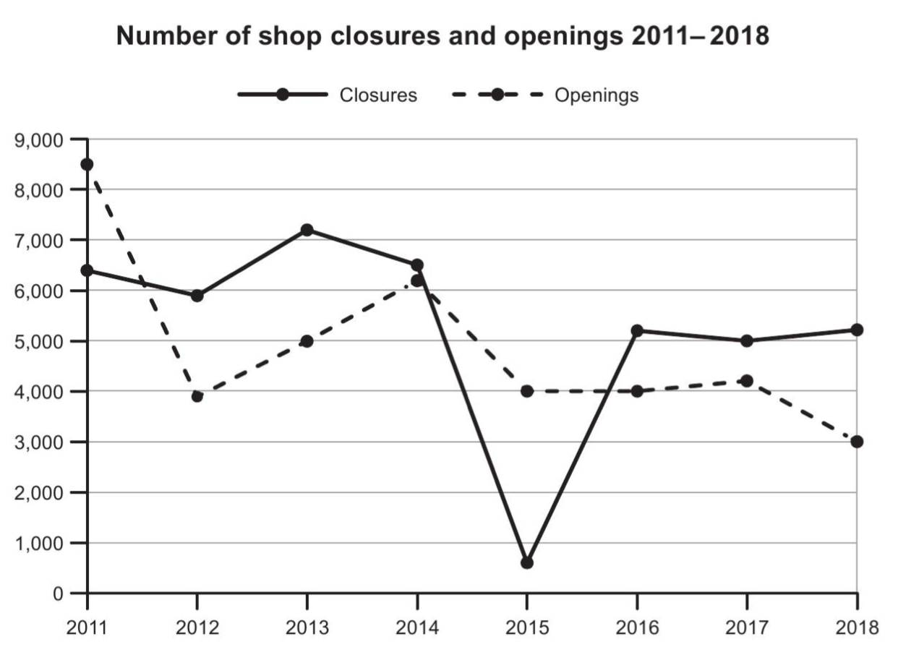

The graph below shows the number of shops that closed and the number of new shops that opened in one country between 2011 and 2018.
Summarise the information by selecting and reporting the main features, and make comparisons where relevant.

The line graph illustrates the number of shop closures and new shop openings in a particular country between 2011 and 2018.

Overall, the number of new shops opened declined markedly over the period, while shop closures fluctuated significantly, including a sharp fall in 2015. Although openings outnumbered closures at the beginning of the period, closures exceeded openings in the later years.

In 2011, approximately 8,500 new shops were opened, compared with about 6,500 closures. Openings then dropped dramatically to 4,000 in 2012 before rising moderately to 5,000 in 2013 and around 6,200 in 2014. From 2015 onwards, the figure fell again, remaining close to 4,000 until 2017 and reaching a low point of 3,000 in 2018.

By contrast, shop closures showed considerable variation. The number decreased slightly from 6,500 in 2011 to 6,000 in 2012, then peaked at roughly 7,200 in 2013. After falling back to 6,500 in 2014, closures plunged to just 500 in 2015. This was followed by a strong recovery, with closures rising to over 5,000 between 2016 and 2018.

From 2016 onwards, the number of closures consistently surpassed openings, suggesting an overall decline in the retail sector during the final years.