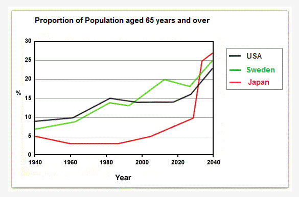

The graph below shows the proportion of the population aged 65 and over between 1940 and 2040 in three different countries.
Summarize the information by selecting and reporting the main features and make comparisons where relevant.

The line graph compares the proportion of people aged 65 and over in the USA, Sweden and Japan from 1940 to 2040.

Overall, all three countries show an ageing trend, though the pace and pattern differ markedly. Japan begins with the smallest elderly population but is projected to experience the most dramatic increase, overtaking both Western countries by the end of the period. By contrast, the USA and Sweden rise more steadily.

In 1940, around 9% of the US population was aged 65 or above, compared with approximately 7% in Sweden and 5% in Japan. The figures for the USA and Sweden increased gradually over the next four decades, reaching about 15% and 14% respectively by 1980. Japan, however, saw a slight decline to around 3% during the same period.

From 1980 onwards, Sweden experienced noticeable fluctuations, climbing to nearly 20% around 2010 before dipping slightly and then rising again. The USA followed a steadier upward trend, reaching roughly 23% by 2040. Japan remained comparatively low until around 2000, after which its elderly population grew sharply, surging to approximately 27% by 2040, the highest among the three countries.

In summary, while population ageing is evident in all three nations, Japan’s increase is far more rapid and pronounced.
