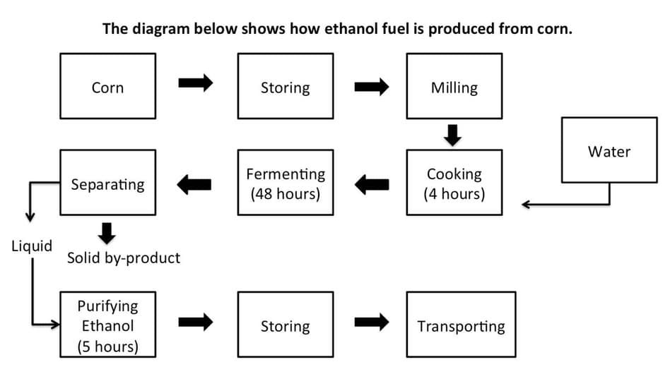

one should spend about 20 minutes on this task.

The diagram below shows how ethanol fuel is produced from corn.

Summarise the information by selecting and reporting the main features and make comparisons where relevant.

You should write at least 150 words.

The diagram illustrates the process of producing ethanol fuel from corn through a series of sequential stages.

Overall, ethanol production involves nine main steps, beginning with the storage of harvested corn and ending with the transportation of the finished fuel. The process includes mechanical, chemical, and biological stages, and it also produces a solid by-product during separation. Notably, specific stages require fixed periods of time, such as cooking, fermenting, and purifying.

At the first stage, corn is stored before being milled into a finer form. The milled corn is then cooked for four hours, during which water is added to facilitate the process. Following cooking, the mixture is transferred to fermentation tanks, where it remains for 48 hours. This is the longest stage in the process and allows sugars to be converted into alcohol.

After fermentation, the mixture undergoes separation, resulting in two outputs. The solid material produced at this stage is removed as a by-product, while the liquid continues to the next step. The liquid is then purified for five hours to obtain ethanol of suitable quality. Finally, the purified ethanol is stored and subsequently transported for use as fuel.

In summary, ethanol fuel production from corn is a linear process with clearly defined stages and time requirements, producing both fuel and a solid by-product.